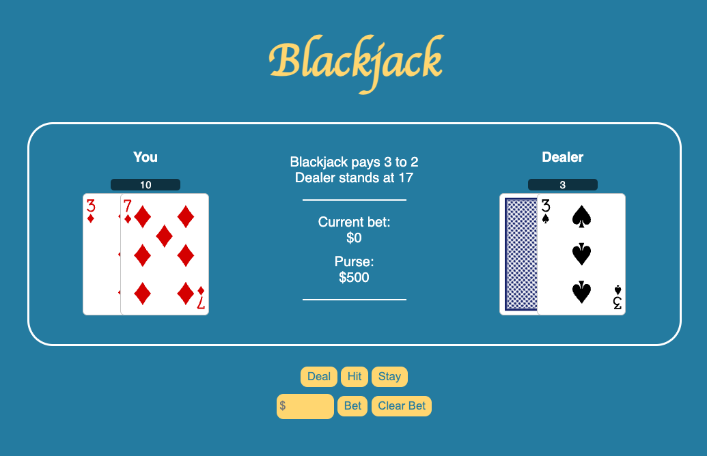

# Blackjack 
 

The object of the game is to win money by creating card totals higher than those of the dealer's hand but not exceeding 21, or by stopping at a total in the hope that the dealer will "bust" (draw higher than 21). On their turn the player can choose to "hit" (take a card) or "stand" (end their turn and stop without taking a card).

Number cards count as their number, the jack, queen, and king ("face cards" or "pictures") count as 10, and aces count as either 1 or 11 according to the player's choice. If the total hand value exceeds 21 points, the hand busts, and all bets on it immediately lose.

After the player completes their turn, the dealer's hand is resolved by drawing cards until the hand achieves a total of 17 or higher. If the dealer busts, the player wins. If the dealer does not bust, the player will wins if their hand is higher than the dealer's and loses if it is lower.

A player total of 21 on the first two cards is a "natural" or "blackjack", and the player wins immediately unless the dealer also has one, in which case the hand ties. In the case of a tie ("push" or "standoff"), bets are returned without adjustment. A blackjack beats any hand that is not a blackjack, even one with a value of 21.

Wins are paid out at even money, except for player blackjacks, which are paid out at 3 to 2 odds.

[Play the game here](https://to-blackjack.netlify.app)

#### Technologies used:
- 
- 
- 
- 

#### Attributions:
- Thanks to Ben Manley for the CSS cardstarter file.

#### Recent Changes:
n/a

#### Icebox: 
- [] add 'double' option for player
- [] add 'split' option for player
- [] add 'surrender' option for player
- [] add background music and sound effects for the card turns

---

[You can view my planning materials for the build out of this game here.](https://docs.google.com/document/d/1I_FMbUUI_8UH3oBAKzyyrsCO0Iuv13MsxqWoMzGSWtM/edit?usp=sharing)
